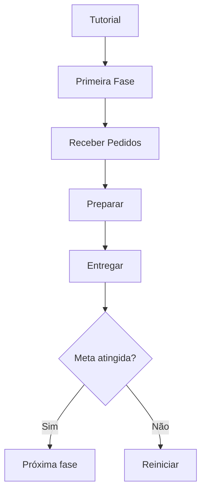

# 🚀 Greedy Evolution!

### 🍔 Evolução Gulosa — Caos culinário no espaço

---

## 🎮 Sobre o Projeto

**Greedy Evolution** é um jogo de simulação culinária estilo **arcade cooperativo local**, onde dois jogadores assumem o papel de chefs robóticos em uma nave espacial.

Enquanto atravessam galáxias, eles precisam preparar pedidos para **clientes extraterrestres impacientes**, lidando com obstáculos e o caos da cozinha.

---

## 🎯 Objetivo

* Completar pedidos dentro do tempo
* Atingir a meta de cada fase
* Avançar por **5 galáxias** com dificuldade progressiva
* Completar **todos os níveis** para finalizar o jogo
* Alcançar **100% de desempenho** para zerar o jogo

---

## 👨‍🍳 Personagens

| Personagem  | Descrição                          |
| ----------- | ---------------------------------- |
| **Romerio** | Chef robótico focado em eficiência |
| **Britto**  | Chef caótico e veloz               |

**Atributos:**

* Velocidade variável (buffs/debuffs)
* Movimentação livre pela cozinha
* Vida ilimitada
* Sistema de pontuação dinâmica baseada em desempenho

---

## 👾 Obstáculos

* ☄️ Meteoritos (tremor na nave)
* 🚧 Elementos do cenário
* 🌪️ Eventos aleatórios

**Efeitos:**

* Lentidão
* Desorientação
* Dificuldade de movimentação

---

## 🗺️ Cenários

* Ambiente: **Espaço**
* Gameplay: **Cozinhas temáticas dentro da nave**

**Elementos:**

* Bancadas
* Fogões
* Áreas de preparo
* Obstáculos
* Caminhos limitados

**Mecanicas:**

* Cada galaxia possuí: **Cozinhas diferentes** e **Mecânicas específicas**

---

## 💰 Sistema de Pontuação

| Ação           | Pontos | Tempo  |
| -------------- | ------ | ------ |
| Pedido correto | + 10   | + 0:30 |
| Pedido errado  | - 5    | - 0:15 |

✔ Pedidos difíceis = aparecem menos e adicionam mais tempo
✔ Pedidos simples = aparecem mais e adicionam menos tempo

⏱️ O tempo aumenta conforme os pedidos são entregues. Quanto mais tempo sobreviver, maior a pontuação.

---

## ❤️ Sistema de Vida

* ♾️ Vida ilimitada
* Sem morte
* Penalidades via:

  * Debuffs
  * Perda de tempo
  * Erros

---

## 🎮 Controles

### Player 1

* Movimento: PgUp / PgDn / Home / End
* Pegar: Shift direito
* Ação: Ctrl direito

### Player 2

* Movimento: W A S D
* Pegar: Shift esquerdo
* Ação: Ctrl esquerdo

---

## 🔄 Fluxo do Jogo



---

## 📜 Regras

* Trabalhar em equipe
* Não atravessar paredes, objetos e limites do mapa
* Entregar pedidos corretamente

**Penalidades:**

* Erro → perda de pontos
* Colisão → debuff

**Interações:**

* Coletar ingredientes
* Preparar receitas 
* Entregar pedidos

---

## 🧩 Estrutura do Projeto

```bash
📁 projeto/
├── main.py
├── player.py
├── pedido.py
├── mapa.py
├── itens.py
├── fase.py
├── interface.py
└── sons.py
```

---

## ⚙️ Funcionalidades Mínimas

* ✔ Sistema de fases
* ✔ Sistema de pedidos
* ✔ Movimentação
* ✔ Interações
* ✔ Pontuação

---

## 🚀 Melhorias Futuras

* Novos obstáculos
* Mais receitas
* Sistema avançado de buffs/debuffs
* Novos mapas
* Eventos dinâmicos
* Multiplayer online

---

## 🎬 Storyboard

1. Tutorial
2. Primeira galáxia
3. Receitas simples
4. Aumento da dificuldade
5. Obstáculos intensos
6. Buffs e debuffs
7. Desafio final

---

## 📦 Como Rodar o Projeto

```bash
# Clone o repositório
git clone https://github.com/seu-usuario/greedy-evolution.git

# Acesse a pasta
cd greedy-evolution

# Instale dependências
pip install pygame

# Execute o jogo
python main.py
```

---

## 🤝 Contribuição

Contribuições são bem-vindas!

1. Fork o projeto
2. Crie uma branch (`git checkout -b feature/minha-feature`)
3. Commit (`git commit -m 'feat: nova feature'`)
4. Push (`git push origin minha-feature`)
5. Abra um Pull Request

---

## 📄 Licença

Este projeto está sob a licença MIT.

---

## ⭐ Créditos

Desenvolvido por estudantes do IFRN 💙
